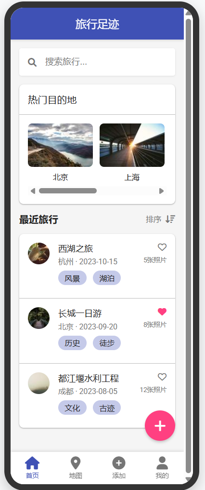
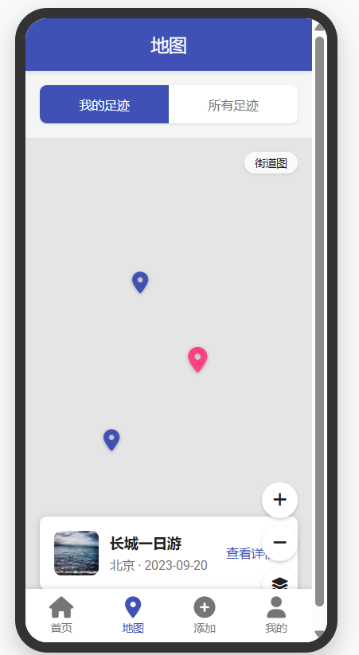
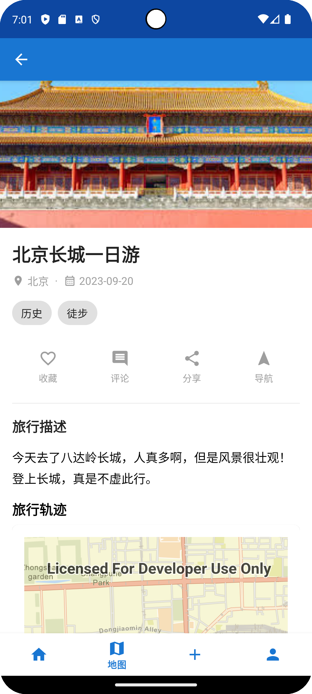
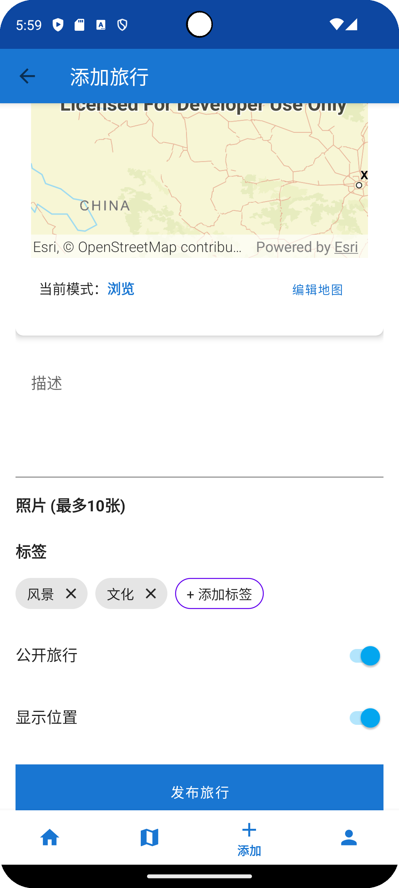
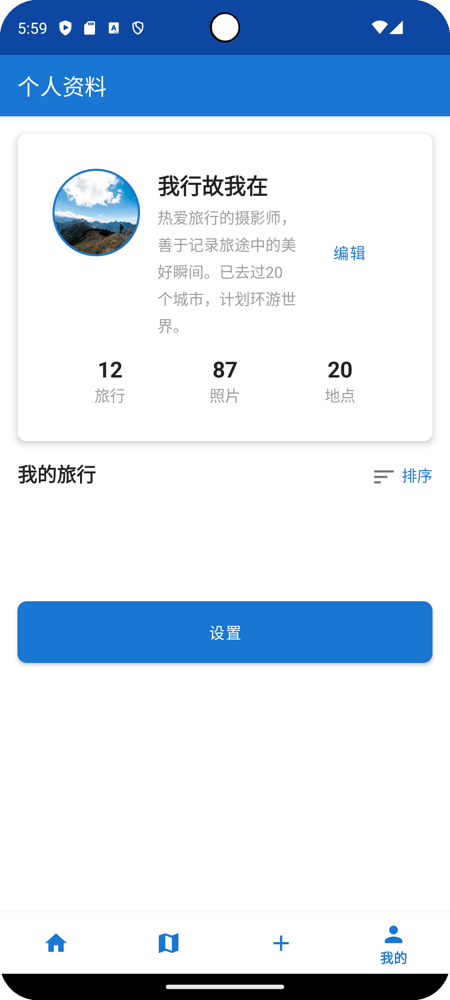

# MemoRoute - 旅行足迹记录应用

"迹忆"是一款专为旅行爱好者设计的Android应用，帮助用户记录、分享和探索旅行足迹。通过直观的地图界面和精美的UI设计，用户可以轻松记录旅行路线、查看热门目的地，并与他人分享旅行体验。

<div align="center">
  
</div>

## 功能特点

### 🏠 精美首页
- 热门目的地轮播展示
- 最近旅行记录列表

### 🗺️ 交互式地图
- 查看个人足迹和全球热门地点
- 支持多种地图类型（街道图、卫星图、地形图）
- 路线回放动画功能

### 📝 旅行记录
- 详细记录旅行信息（标题、地点、日期、描述等）
- 添加旅行路线和足迹点
- 支持上传照片

### 👤 个人中心
- 个性化用户资料
- 旅行统计数据
- 收藏管理

## 应用截图

<div align="center">
  
  
  
</div>

<div align="center">
  
  
</div>

## 技术特点

### 架构
- 基于MVVM架构设计
- 使用Jetpack组件（Navigation、ViewModel、LiveData等）
- 模块化设计，便于扩展

### 地图功能
- 集成ArcGIS Runtime SDK实现强大的地图功能
- 支持自定义地图样式和交互
- 高效的地理数据处理

### UI/UX
- 遵循Material Design设计规范
- 流畅的动画和过渡效果
- 响应式布局，适配各种屏幕尺寸

### 数据管理
- 本地数据持久化
- 高效的图片加载和缓存（使用Glide）
- 支持离线模式

## 安装指南

1. 克隆仓库到本地
```bash
git clone https://github.com/memoroute/MemoRoute.git  
```

2. 使用Android Studio打开项目

3. 配置ArcGIS API密钥
   - 在`MemoRouteApplication.kt`文件中修改  ：
   ```
   val key = YOUR_API_KEY
   ```

4. 构建并运行应用
```bash
./gradlew assembleDebug
```

## 项目结构

```
app/
├── src/main/
│   ├── java/com/example/memoroutev2/
│   │   ├── data/                # 数据源和存储库
│   │   │   └── DataSource.kt    # 数据源实现
│   │   ├── model/               # 数据模型
│   │   │   ├── Trip.kt          # 旅行模型
│   │   │   ├── TripLocation.kt  # 旅行地点模型
│   │   │   ├── Destination.kt   # 目的地模型
│   │   │   ├── User.kt          # 用户模型
│   │   │   └── Comment.kt       # 评论模型
│   │   ├── ui/                  # UI组件
│   │   │   ├── add/             # 添加旅行
│   │   │   ├── detail/          # 旅行详情
│   │   │   ├── home/            # 首页相关
│   │   │   ├── map/             # 地图相关
│   │   │   ├── profile/         # 个人资料
│   │   │   ├── search/          # 搜索功能
│   │   │   └── theme/           # 应用主题
│   │   ├── MainActivity.kt      # 主活动
│   │   ├── SplashActivity.kt    # 启动页活动
│   │   └── MemoRouteApplication.kt # 应用程序类
│   ├── res/                     # 资源文件
│   │   ├── anim/                # 动画资源
│   │   ├── drawable/            # 图形资源
│   │   ├── layout/              # 布局文件
│   │   ├── menu/                # 菜单资源
│   │   ├── navigation/          # 导航图
│   │   ├── values/              # 字符串、样式等
│   │   └── xml/                 # XML配置文件
│   └── AndroidManifest.xml      # 应用清单
└── build.gradle.kts             # 应用级构建配置
```

## 未来计划

- [ ] 添加社交功能，允许用户关注好友
- [ ] 集成更多第三方地图服务
- [ ] 支持更丰富的媒体内容（视频、音频等）
- [ ] 添加AI推荐功能
