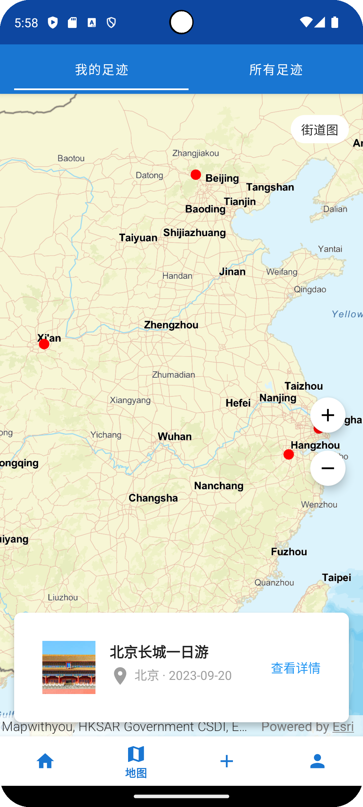

# MemoRoute - 旅行足迹记录应用

MemoRoute是一款专为旅行爱好者设计的Android应用，帮助用户记录、分享和探索旅行足迹。通过直观的地图界面和精美的UI设计，用户可以轻松记录旅行路线、查看热门目的地，并与他人分享旅行体验。


## 功能特点

### 🏠 精美首页
- 热门目的地轮播展示
- 最近旅行记录列表
- 快速访问常用功能

### 🗺️ 交互式地图
- 查看个人足迹和全球热门地点
- 支持多种地图类型（街道图、卫星图、地形图）
- 路线回放动画功能

### 📝 旅行记录
- 详细记录旅行信息（标题、地点、日期、描述等）
- 添加旅行路线和足迹点
- 支持上传照片

### 👤 个人中心
- 个性化用户资料
- 旅行统计数据
- 收藏管理

## 应用截图

<div align="center">
  
  
  
</div>

<div align="center">
  
  
</div>

## 技术特点

### 架构
- 基于MVVM架构设计
- 使用Jetpack组件（Navigation、ViewModel、LiveData等）
- 模块化设计，便于扩展

### 地图功能
- 集成ArcGIS Runtime SDK实现强大的地图功能
- 支持自定义地图样式和交互
- 高效的地理数据处理

### UI/UX
- 遵循Material Design设计规范
- 流畅的动画和过渡效果
- 响应式布局，适配各种屏幕尺寸

### 数据管理
- 本地数据持久化
- 高效的图片加载和缓存（使用Glide）
- 支持离线模式

## 安装指南

1. 克隆仓库到本地
```bash
git clone https://github.com/yourusername/memoroutev2.git
```

2. 使用Android Studio打开项目

3. 配置ArcGIS API密钥
   - 在`local.properties`文件中添加：
   ```
   arcgis.api.key=YOUR_API_KEY
   ```

4. 构建并运行应用
```bash
./gradlew assembleDebug
```

## 项目结构

```
app/
├── src/main/
│   ├── java/com/example/memoroutev2/
│   │   ├── data/           # 数据源和存储库
│   │   ├── model/          # 数据模型
│   │   ├── ui/             # UI组件
│   │   │   ├── home/       # 首页相关
│   │   │   ├── map/        # 地图相关
│   │   │   ├── add/        # 添加旅行
│   │   │   ├── detail/     # 旅行详情
│   │   │   └── profile/    # 个人资料
│   │   └── utils/          # 工具类
│   └── res/                # 资源文件
└── build.gradle            # 应用级构建配置
```

## 未来计划

- [ ] 添加社交功能，允许用户关注好友
- [ ] 集成更多第三方地图服务
- [ ] 支持更丰富的媒体内容（视频、音频等）
- [ ] 开发iOS版本
- [ ] 添加AI推荐功能

## 贡献指南

1. Fork项目
2. 创建特性分支 (`git checkout -b feature/amazing-feature`)
3. 提交更改 (`git commit -m 'Add some amazing feature'`)
4. 推送到分支 (`git push origin feature/amazing-feature`)
5. 创建Pull Request

## 许可证

本项目采用MIT许可证 - 详情请查看 [LICENSE](LICENSE) 文件

## 联系方式

项目维护者 - [你的名字](mailto:your.email@example.com)

项目链接: [https://github.com/yourusername/memoroutev2](https://github.com/yourusername/memoroutev2) 